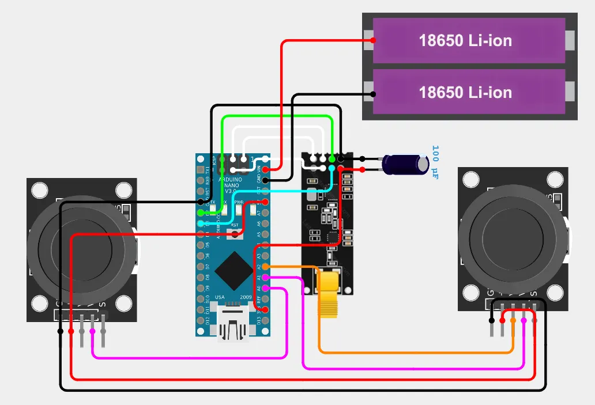
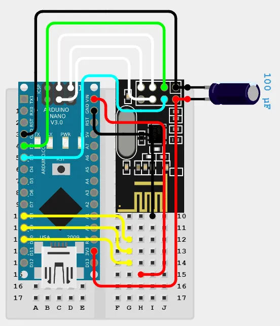
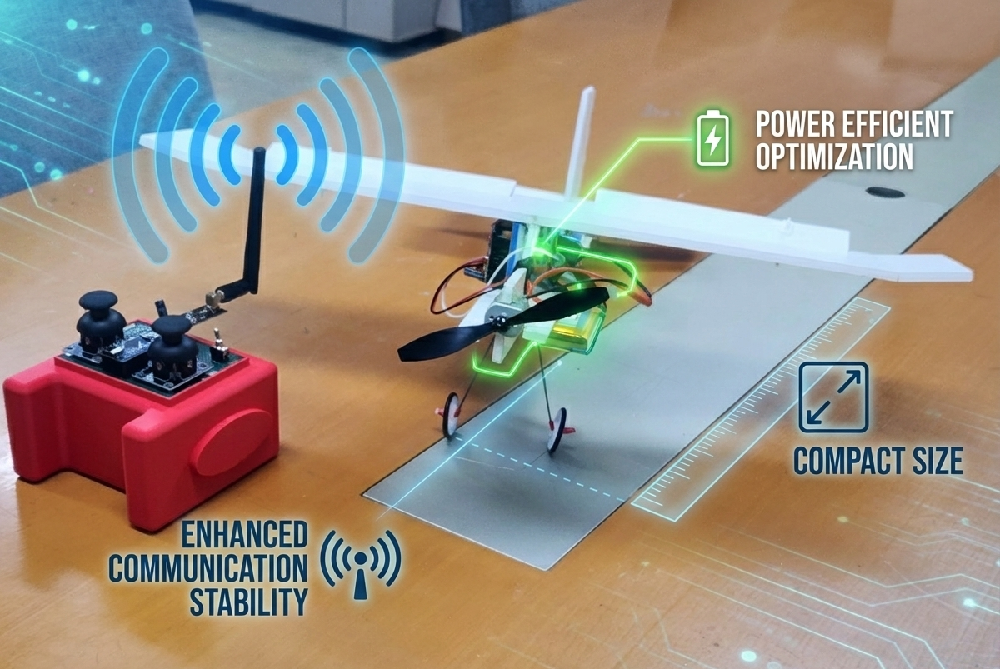

# DIY 고정익 항공기 제어 시스템

<p align="center">
  <strong>Arduino Nano 기반 RF 무선 제어 시스템 구현 프로젝트</strong>
</p>

---

## 📊 프로젝트 개요

상용 RC 송수신기의 높은 가격과 제한적인 커스터마이징 문제를 해결하기 위해, Arduino Nano와 nRF24L01+ 모듈을 활용한 저비용 DIY 무선 제어 시스템을 설계 및 구현하였습니다. 송신기는 조이스틱 입력을 RF 신호로 전송하고, 수신기는 이를 받아 ESC 및 서보를 제어하여 고정익 항공기를 안정적으로 조종할 수 있습니다.

---

## 🎯 문제 정의

기존 상용 RC 송수신기는 다음과 같은 한계가 있습니다:

- 고가의 가격 (10만원 이상)으로 학습 및 실험 목적으로 접근하기 어려움
- 내부 로직 수정이 불가능하여 특수 기능 추가 및 커스터마이징 제한
- RF 통신, 센서 제어, 신호 처리 등 핵심 기술을 이해하고 학습할 기회 부족
- 전력 최적화 및 안전 기능을 직접 설계할 수 없음

---

## ✅ 해결 전략

### 1. 저비용 하드웨어 플랫폼 구축
- Arduino Nano + nRF24L01+ 모듈 활용으로 제작 비용 2~3만원 달성
- 상용 제품 대비 70% 이상 비용 절감

### 2. 안정적인 RF 통신 구현
- 50Hz 전송 주기 (20ms 간격)로 실시간 제어 보장
- Auto-ACK 및 재전송 로직으로 통신 신뢰성 확보
- 108번 채널, 250kbps 속도로 간섭 최소화

### 3. 다층 안전 시스템 설계
- 신호 끊김 자동 감지 (1초 이내) 및 페일세이프 모드
- 전송 실패 시 재시도 (최대 2회) 및 50회 연속 실패 시 자동 재초기화
- ESC 안전 범위 설정 (1510~2000us)으로 우발적 작동 방지

### 4. 전력 최적화 메커니즘
- 서보 중립 2초 유지 시 자동 detach로 전력 절약
- 천천히 움직이기 (20ms마다 1도) 및 스무딩 필터로 전류 급증 방지
- 데드밴드 적용으로 불필요한 미세 움직임 제거

### 5. 정밀한 조이스틱 캘리브레이션
- 중립 데드존 설정 (480~540) 및 방향별 값 반전 처리
- Throttle 특수 처리 (중립 이하는 0으로 매핑)
- 디버그 모드로 실시간 raw 값 확인 가능

---

## 🚀 주요 기능

### 송신기 (Transmitter)
- ✅ **3축 조이스틱 제어**: Throttle, Aileron, Elevator 입력 처리
- ✅ **50Hz RF 전송**: 20ms 간격 실시간 데이터 전송
- ✅ **자동 재전송 로직**: 최대 2회 재시도로 신뢰성 확보
- ✅ **디버그 모드**: 전송률, 실패 횟수, 조이스틱 raw 값 실시간 출력
- ✅ **캘리브레이션 지원**: 중립 데드존 및 범위 조정 가능
- ✅ **자동 재초기화**: 50회 연속 실패 시 라디오 모듈 리셋

### 수신기 (Receiver)
- ✅ **ESC 제어**: DC 모터 속도 조절 (1510~2000us PWM)
- ✅ **서보 2채널 제어**: Aileron 및 Elevator (30~150° 범위)
- ✅ **신호 끊김 감지**: 1초 이상 무신호 시 안전 모드 자동 진입
- ✅ **스무딩 필터**: 급격한 움직임 방지 (계수 0.2)
- ✅ **데드밴드 적용**: 3도 (중립 근처 5도) 떨림 제거
- ✅ **서보 자동 절전**: 중립 2초 유지 시 detach로 전력 절약
- ✅ **천천히 움직이기**: 20ms마다 1도씩 이동하여 전류 급증 방지

---

## 🛠️ 기술 스택

### Hardware
- **Arduino Nano**: ATmega328P 기반 마이크로컨트롤러
- **nRF24L01+**: 2.4GHz RF 통신 모듈
- **Analog Joystick**: 2축 아날로그 조이스틱 3개
- **ESC**: DC 모터 전자 속도 제어기
- **Servo Motor**: SG90 또는 호환 서보 2개

### Software
- **Arduino IDE**: 펌웨어 개발 환경
- **RF24 Library**: nRF24L01+ 통신 라이브러리 (by TMRh20)
- **Servo Library**: 서보 제어 라이브러리 (Arduino 기본 포함)
- **SPI Library**: SPI 통신 (Arduino 기본 포함)

### Communication Protocol
- **Channel**: 108
- **Data Rate**: 250kbps (RF24_250KBPS)
- **PA Level**: MAX (RF24_PA_MAX)
- **Frequency**: 50Hz (20ms interval)

---

## 📊 시스템 구성도

### 송신기 (Transmitter) 하드웨어

| 구성 요소 | 모델 | 수량 | 연결 핀 |
|----------|------|------|---------|
| 마이크로컨트롤러 | Arduino Nano | 1 | - |
| RF 모듈 | nRF24L01+ | 1 | CE=D2, CSN=D3, SCK=D13, MOSI=D11, MISO=D12 |
| 조이스틱 (Throttle) | 2축 아날로그 | 1 | A1 (X축) |
| 조이스틱 (Aileron) | 2축 아날로그 | 1 | A0 (Y축) |
| 조이스틱 (Elevator) | 2축 아날로그 | 1 | A2 (X축) |



### 수신기 (Receiver) 하드웨어

| 구성 요소 | 모델 | 수량 | 연결 핀 |
|----------|------|------|---------|
| 마이크로컨트롤러 | Arduino Nano | 1 | - |
| RF 모듈 | nRF24L01+ | 1 | CE=D2, CSN=D3, SCK=D13, MOSI=D11, MISO=D12 |
| ESC | - | 1 | D8 (PWM) |
| 서보 (Aileron) | SG90 또는 호환 | 1 | D9 |
| 서보 (Elevator) | SG90 또는 호환 | 1 | D10 |



---

## 📦 설치 및 실행

### 1. 저장소 클론

```bash
git clone https://github.com/yourusername/diy-rc-airplane.git
cd diy-rc-airplane
```

### 2. 필수 라이브러리 설치

Arduino IDE에서 라이브러리 관리자를 열고 다음을 설치하세요:
- **RF24** by TMRh20

또는 Arduino CLI 사용:

```bash
arduino-cli lib install "RF24"
```

> **참고**: `Servo` 라이브러리는 Arduino IDE에 기본 포함되어 있습니다.

### 3. 하드웨어 연결

위의 **시스템 구성도** 섹션을 참고하여 송신기와 수신기를 각각 조립합니다.

**주의사항**:
- nRF24L01+ 모듈은 반드시 **3.3V**로 전원 공급
- 전원 안정화를 위해 10uF 캐패시터 추가 권장
- ESC는 별도 배터리로 전원 공급 (Arduino와 GND만 공유)

### 4. 코드 업로드

#### 송신기
1. Arduino IDE에서 `src/transmitter.ino` 파일 열기
2. 보드 선택: `Tools > Board > Arduino Nano`
3. 프로세서 선택: `Tools > Processor > ATmega328P (Old Bootloader)`
4. 포트 선택: `Tools > Port > COM3` (환경에 따라 다름)
5. 업로드 버튼 클릭

또는 Arduino CLI 사용:

```bash
arduino-cli compile --fqbn arduino:avr:nano:cpu=atmega328old src/transmitter.ino
arduino-cli upload -p COM3 --fqbn arduino:avr:nano:cpu=atmega328old src/transmitter.ino
```

#### 수신기
1. Arduino IDE에서 `src/receiver.ino` 파일 열기
2. 동일한 방법으로 보드, 프로세서, 포트 선택
3. 업로드 버튼 클릭

또는 Arduino CLI 사용:

```bash
arduino-cli compile --fqbn arduino:avr:nano:cpu=atmega328old src/receiver.ino
arduino-cli upload -p COM4 --fqbn arduino:avr:nano:cpu=atmega328old src/receiver.ino
```

### 5. 디버그 모드 활성화

코드 상단에서 `DEBUG_MODE`를 조정하여 시리얼 모니터 출력 제어:

```cpp
#define DEBUG_MODE 1  // 1: 활성화, 0: 비활성화
```

시리얼 모니터 설정:
- 보드 레이트: **9600 bps**
- 줄 바꿈: **Both NL & CR**

### 6. 출력 결과

#### 송신기 (DEBUG_MODE=1)
```
=== RC Glider Transmitter ===

Initializing NRF24L01...
NRF24L01 initialized OK!

Settings:
  Channel: 108
  Data Rate: 250kbps
  PA Level: MAX
  Auto-ACK: ON

Ready to transmit!
================================

TX:50/s [OK]    | T:128 | A:127 | E:127 |    [Raw] T(A1)=512 | A(A0)=510 | E(A2)=515
```

#### 수신기 (DEBUG_MODE=1)
```
=== RC Glider Receiver ===
ESC: 1510~2000us
Servo: Slow move enabled
Ready!

RX:48 | T:128(1755us) | A:90°→90 ON | E:85°→85 ON
```

### 7. 조이스틱 캘리브레이션

디버그 모드에서 조이스틱 raw 값을 확인하고, `transmitter.ino`에서 중립값 조정:

```cpp
#define JOY_CENTER_MIN 480  // 실측 중립값 - 30
#define JOY_CENTER_MAX 540  // 실측 중립값 + 30
```

---

## 📁 프로젝트 구조

```
diy-rc-airplane/
├── src/
│   ├── transmitter.ino       # 송신기 펌웨어
│   └── receiver.ino          # 수신기 펌웨어
├── img/
│   ├── layout-transmitter.png  # 송신기 회로도
│   ├── layout-receiver.png     # 수신기 회로도
│   ├── result-1.png           # 완성 사진 1
│   └── result-2.png           # 완성 사진 2
├── .gitignore
└── README.md
```

---

## 📐 통신 프로토콜

### 데이터 구조체

```cpp
struct Signal {
  byte throttle;   // 0~255 (모터 속도)
  byte aileron;    // 0~255 (127=중립, 좌우 제어)
  byte elevator;   // 0~255 (127=중립, 상하 제어)
  byte rudder;     // 미사용 (예약)
};
```

### 신호 매핑

#### 송신기 → 수신기
- **Throttle**: `0` = 정지, `1~255` = 가속 (ESC 1510~2000us로 변환)
- **Aileron**: `0` = 우측 최대, `127` = 중립, `255` = 좌측 최대 (30~150°)
- **Elevator**: `0` = 하강 최대, `127` = 중립, `255` = 상승 최대 (30~150°)

#### RF 설정
```cpp
채널: 108
속도: 250kbps (RF24_250KBPS)
출력: 최대 (RF24_PA_MAX)
주소: "JBKPJ"
Auto-ACK: 활성화
재전송 설정: setRetries(5, 15)
```

---

## 🎯 성과 지표

### 비용 효율성
- ✅ **제작 비용**: 약 2~3만원 (상용 제품 10만원 대비 **70% 절감**)
- ✅ **부품 조달**: 일반 전자부품 상점에서 쉽게 구매 가능

### 통신 안정성
- ✅ **전송 주파수**: 50Hz (20ms 간격) 달성
- ✅ **신호 복구**: 끊김 감지 1초 이내, 자동 페일세이프 모드
- ✅ **재전송 메커니즘**: 전송 실패 시 최대 2회 재시도

### 제어 정밀도
- ✅ **서보 각도 범위**: 30~150° (120° 가동 범위)
- ✅ **ESC 펄스 정밀도**: 1510~2000us (490us 분해능)
- ✅ **응답 속도**: 20ms 업데이트 주기

### 안전 기능
- ✅ **3중 안전장치**: 신호 끊김 감지, 재전송, 자동 재초기화
- ✅ **전력 최적화**: 서보 자동 절전 (중립 2초 유지 시)
- ✅ **전류 보호**: 천천히 움직이기 + 스무딩 필터

---

## 🔧 파라미터 튜닝 가이드

### 송신기 (transmitter.ino)
| 파라미터 | 위치 | 기본값 | 설명 |
|---------|------|-------|------|
| `TRANSMIT_INTERVAL` | 62행 | 20ms | 전송 주기 (50Hz) |
| `JOY_CENTER_MIN` | 35행 | 480 | 조이스틱 중립 하한 |
| `JOY_CENTER_MAX` | 36행 | 540 | 조이스틱 중립 상한 |

### 수신기 (receiver.ino)
| 파라미터 | 위치 | 기본값 | 설명 |
|---------|------|-------|------|
| `SMOOTHING` | 74행 | 0.2 | 스무딩 계수 (0.0~1.0, 클수록 빠름) |
| `SERVO_UPDATE_INTERVAL` | 85행 | 20ms | 서보 업데이트 주기 |
| `ESC_MIN` | 41행 | 1510us | ESC 최소 펄스 (측정 필요) |
| `ESC_MAX` | 42행 | 2000us | ESC 최대 펄스 |
| `SERVO_MIN` | 34행 | 30° | 서보 최소 각도 |
| `SERVO_MAX` | 35행 | 150° | 서보 최대 각도 |

---

## 🔧 주요 코드 구조

### 송신기 핵심 함수
```cpp
bool initRadio()           // RF 모듈 초기화 (재시도 포함)
byte mapThrottle()         // Throttle 조이스틱 값 매핑 (0~255)
byte mapAileron()          // Aileron 조이스틱 값 매핑 (데드존 적용)
byte mapElevator()         // Elevator 조이스틱 값 매핑 (값 반전)
void readJoysticks()       // 조이스틱 값 읽기 및 구조체 저장
```

### 수신기 핵심 함수
```cpp
void ResetData()           // 신호 끊김 시 안전 값 설정
int applyDeadband()        // 데드밴드 적용 (떨림 제거)
```

### 통신 흐름
1. **송신기**: 조이스틱 읽기 → 매핑 → RF 전송 (50Hz)
2. **수신기**: RF 수신 → 스무딩 → 데드밴드 → 서보/ESC 출력

---

## 🛠️ 트러블슈팅

### 문제: nRF24L01 초기화 실패
**증상**:
```
ERROR: NRF24L01 init failed!
```

**원인**:
- 전원 불안정 (3.3V 미공급 또는 전압 강하)
- SPI 배선 오류
- 불량 모듈

**해결 방법**:
1. nRF24L01+ 모듈에 **3.3V** 정확히 공급 확인
2. 10uF~100uF 캐패시터를 VCC-GND 사이에 추가
3. SPI 핀 배선 재확인:
   - CE → D2
   - CSN → D3
   - SCK → D13
   - MOSI → D11
   - MISO → D12
4. 다른 nRF24L01+ 모듈로 교체 테스트

---

### 문제: 통신 끊김 및 불안정
**증상**:
```
!!! WARNING: Connection unstable !!!
```

**원인**:
- 전파 간섭 (WiFi, Bluetooth 등)
- 통신 거리 과다
- 안테나 불량

**해결 방법**:
1. 채널 변경: `radio.setChannel(108)` → 다른 채널 (0~125)
2. nRF24L01+ **+PA+LNA** 모듈로 교체 (장거리 통신)
3. 안테나 각도 조정 및 장애물 제거

---

### 문제: 서보 떨림 (Jittering)
**증상**:
- 서보가 중립 위치에서 미세하게 떨림

**원인**:
- 전원 노이즈
- 스무딩 부족
- 데드밴드 설정 부족

**해결 방법**:
1. `SMOOTHING` 값 낮추기: `0.2` → `0.1` (receiver.ino:74)
2. 데드밴드 확대: `applyDeadband()` 함수의 `deadband` 값 증가 (receiver.ino:110)
3. 서보에 별도 전원 공급 (Arduino와 GND만 공유)
4. 전원 라인에 캐패시터 추가

---

### 문제: ESC 작동 안함
**증상**:
- 모터가 전혀 회전하지 않음
- ESC에서 경고음 발생

**원인**:
- ESC 캘리브레이션 미수행
- PWM 펄스 범위 불일치
- 배선 오류

**해결 방법**:
1. ESC 매뉴얼 참고하여 캘리브레이션 수행
2. `ESC_MIN` 값 조정 (receiver.ino:41):
   - 일반적 범위: 1000~1500us (최소), 1500~2000us (최대)
   - ESC 사양 확인 필수
3. ESC 신호선 연결 확인 (D8)
4. 배터리 전압 확인 (ESC 사양에 맞는 전압)

---

### 문제: 조이스틱 중립 위치 오류
**증상**:
- 조이스틱을 놓아도 서보가 중립으로 가지 않음

**해결 방법**:
1. 디버그 모드 활성화 (`DEBUG_MODE 1`)
2. 시리얼 모니터에서 조이스틱 raw 값 확인
3. 중립값을 측정하여 `transmitter.ino`에서 조정:
   ```cpp
   #define JOY_CENTER_MIN [측정값 - 30]
   #define JOY_CENTER_MAX [측정값 + 30]
   ```

---

## 📸 완성 사진




---

## 👨‍💻 개발자

- **GitHub**: [@jaebinary](https://github.com/jaebinary)

---

## 📚 참고 자료

- [nRF24L01+ Datasheet](https://www.nordicsemi.com/products/nrf24-series)
- [RF24 Library Documentation](https://nrf24.github.io/RF24/)
- [Arduino Servo Library Reference](https://www.arduino.cc/reference/en/libraries/servo/)
