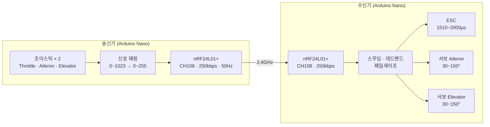

# [Arduino Nano] nRF24L01+ 기반 DIY RC 항공기 송수신기

2.4GHz nRF24L01+ 무선 모듈로 조이스틱 신호를 50Hz로 전송하고, 수신기에서 ESC와 서보를 직접 구동하는 저비용 RC 시스템이다.

---

<br>

## 목차

- [시스템 구성](#시스템-구성)
- [하드웨어 구성](#하드웨어-구성)
- [통신 프로토콜](#통신-프로토콜)
- [핵심 구현: 조이스틱 매핑](#핵심-구현-조이스틱-매핑)
- [핵심 구현: 신호 안정화](#핵심-구현-신호-안정화)
- [핀 매핑](#핀-매핑)
- [빌드 환경](#빌드-환경)
- [기술문서](#기술문서)

---

<br>

## 시스템 구성

조이스틱 2개 입력이 RF를 통해 50Hz로 전달되고, 수신기가 ESC와 서보 2채널을 직접 구동한다.



---

<br>

## 하드웨어 구성

### 송신기

| 구성요소 | 모델 | 핀 |
|---------|------|----|
| MCU | Arduino Nano (ATmega328P) | — |
| RF 모듈 | nRF24L01+ | CE=D2, CSN=D3, SPI |
| 조이스틱 1 (Throttle) | 2축 아날로그 | A1 (위아래 → 모터 속도) |
| 조이스틱 2 (Aileron/Elevator) | 2축 아날로그 | A0 (좌우 → Aileron), A2 (위아래 → Elevator) |

### 수신기

| 구성요소 | 모델 | 핀 |
|---------|------|----|
| MCU | Arduino Nano (ATmega328P) | — |
| RF 모듈 | nRF24L01+ | CE=D2, CSN=D3, SPI |
| ESC | — | D8 (PWM) |
| 서보 Aileron | SG90 또는 호환 | D9 |
| 서보 Elevator | SG90 또는 호환 | D10 |

---

<br>

## 통신 프로토콜

송신기와 수신기는 4바이트 구조체를 20ms(50Hz) 간격으로 주고받는다.

```cpp
struct Signal {
    byte throttle;  // 0=정지, 1~255=속도
    byte aileron;   // 0~255 (127=중립)
    byte elevator;  // 0~255 (127=중립)
    byte rudder;    // 예약 (항상 127)
};
```

| 파라미터 | 값 | 설명 |
|---------|-----|------|
| 채널 | 108 | 2.4GHz 대역 간섭 최소화 |
| 데이터 속도 | 250kbps | 낮은 속도 = 도달 거리↑, 신뢰성↑ |
| PA 레벨 | MAX | 최대 출력 |
| Auto-ACK | 활성화 | 전송 확인 응답 |
| 재전송 | setRetries(5, 15) | 5단계 지연, 최대 15회 |
| 전송 주기 | 20ms (50Hz) | 실시간 제어 |
| 통신 주소 | `"JBKPJ"` | 5바이트 고정 주소 |

---

<br>

## 핵심 구현: 조이스틱 매핑

조이스틱 ADC 값(0~1023)을 채널별로 0~255 byte에 매핑한다. 중립 범위(480~540)를 데드존으로 설정하여 센서 오차를 흡수한다.

```cpp
#define JOY_CENTER_MIN 480  // 중립 하한
#define JOY_CENTER_MAX 540  // 중립 상한
```

```cpp
// Throttle: 값 반전(위=최대), 중립 이하는 0
byte mapThrottle(int rawValue) {
    int inverted = JOY_MAX - rawValue;
    if (inverted < JOY_CENTER_MAX) return 0;
    return map(inverted, JOY_CENTER_MAX, JOY_MAX, 0, 255);
}

// Aileron: 데드존 적용, 중립=127
byte mapAileron(int rawValue) {
    if (rawValue >= JOY_CENTER_MIN && rawValue <= JOY_CENTER_MAX) return 127;
    if (rawValue < JOY_CENTER_MIN)
        return map(rawValue, JOY_MIN, JOY_CENTER_MIN, 0, 126);
    return map(rawValue, JOY_CENTER_MAX, JOY_MAX, 128, 255);
}

// Elevator: 값 반전 + 데드존, 중립=127
byte mapElevator(int rawValue) {
    int inverted = JOY_MAX - rawValue;
    // Aileron과 동일 로직 (반전된 값으로 적용)
}
```

| 채널 | ADC 핀 | 중립값 | 특이사항 |
|------|--------|--------|---------|
| Throttle | A1 | 0 (정지) | 중립 이하 → 0, 위=최대 |
| Aileron | A0 | 127 | 데드존 적용 |
| Elevator | A2 | 127 | 값 반전 + 데드존 |

---

<br>

## 핵심 구현: 신호 안정화

수신기에서 급격한 서보 움직임을 방지하고 신호 끊김을 안전하게 처리한다.

### 스무딩 필터

```cpp
const float SMOOTHING = 0.2;
smoothed = smoothed * (1.0 - SMOOTHING) + target * SMOOTHING;
```

이전 값 80%, 새 값 20%를 반영한다. 값을 낮출수록 움직임이 부드러워진다.

### 데드밴드

서보 목표값이 현재값과 3도 이내이면 이동하지 않는다. 중립(85~95도) 근처는 5도로 확대하여 미세 떨림을 제거한다.

### 페일세이프

마지막 수신 후 1초 이상 신호가 없으면 `ResetData()`로 안전값을 설정한다.

```cpp
void ResetData() {
    data.throttle = 0;    // 모터 정지
    data.aileron  = 127;  // 서보 중립
    data.elevator = 127;  // 서보 중립
}
```

### 서보 자동 절전

중립(±5~10도) 위치에서 2초 이상 머물면 `detach()`하여 전력을 절약하고, 중립을 벗어나면 즉시 `attach()`한다.

### 천천히 움직이기

20ms마다 최대 1도씩 이동하여 전류 급증을 방지한다.

```cpp
const unsigned long SERVO_UPDATE_INTERVAL = 20;  // 20ms마다 1도 이동
```

---

<br>

## 핀 매핑

### 송신기

| 핀 | 신호 | 설명 |
|----|------|------|
| D2 | nRF24 CE | RF 모듈 칩 Enable |
| D3 | nRF24 CSN | SPI 칩 셀렉트 |
| D11 | SPI MOSI | RF 데이터 출력 |
| D12 | SPI MISO | RF 데이터 입력 |
| D13 | SPI SCK | RF 클럭 |
| A0 | 조이스틱 2 X축 | Aileron 좌우 입력 |
| A1 | 조이스틱 1 Y축 | Throttle 모터 속도 입력 |
| A2 | 조이스틱 2 Y축 | Elevator 상하 입력 |

### 수신기

| 핀 | 신호 | 설명 |
|----|------|------|
| D2 | nRF24 CE | RF 모듈 칩 Enable |
| D3 | nRF24 CSN | SPI 칩 셀렉트 |
| D8 | ESC PWM | 모터 속도 (1510~2000µs) |
| D9 | Aileron 서보 | 좌우 조종면 (30~150°) |
| D10 | Elevator 서보 | 상하 조종면 (30~150°) |
| D11 | SPI MOSI | RF 데이터 출력 |
| D12 | SPI MISO | RF 데이터 입력 |
| D13 | SPI SCK | RF 클럭 |

---

<br>

## 빌드 환경

| 항목 | 내용 |
|------|------|
| IDE | Arduino IDE 2.x |
| 보드 | Arduino Nano |
| 프로세서 | ATmega328P (Old Bootloader) |
| 라이브러리 | RF24 by TMRh20, Servo (Arduino 기본) |
| 디버그 통신 | UART 9600 baud (`#define DEBUG_MODE 1`) |

---

<br>

## 기술문서

각 구성 요소와 알고리즘을 주제별로 설명하는 문서 목록이다. 전체 목차는 [docs/README.md](./docs/README.md)에서 확인할 수 있다.


[def]: #기술문서