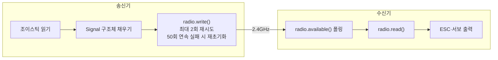

# nRF24L01+ 무선 통신

nRF24L01+ 모듈의 채널, 데이터 속도, 주소를 설정하고 4바이트 Signal 구조체를 50Hz로 주고받는 방법을 설명합니다.

nRF24L01+는 2.4GHz 대역의 저전력 RF 트랜시버입니다. 채널을 108로 설정하면 Wi-Fi(1·6·11채널)와 겹치지 않아 간섭이 줄어듭니다. 250kbps의 낮은 데이터 속도를 선택하면 신호 감도가 높아져 도달 거리가 늘어납니다.

---

<br>

## RF 파라미터

| 파라미터 | 값 | 설명 |
|---------|-----|------|
| 채널 | 108 | 2.4GHz 대역 간섭 최소화 |
| 데이터 속도 | 250kbps | 낮을수록 도달 거리↑, 신뢰성↑ |
| PA 레벨 | MAX | 최대 출력 |
| Auto-ACK | 활성화 | 수신 확인 응답 |
| 재전송 | `setRetries(5, 15)` | 5단계 지연, 최대 15회 |
| 통신 주소 | `"JBKPJ"` | 5바이트 고정 주소 |
| 전송 주기 | 20ms (50Hz) | 실시간 제어 보장 |

---

<br>

## Signal 구조체

송신기와 수신기가 공유하는 4바이트 데이터 구조체다.

```cpp
struct Signal {
    byte throttle;  // 0=정지, 1~255=속도 (ESC 1510~2000µs로 변환)
    byte aileron;   // 0~255, 127=중립 (서보 30~150°로 변환)
    byte elevator;  // 0~255, 127=중립 (서보 30~150°로 변환)
    byte rudder;    // 예약 (항상 127, 현재 미사용)
};
```

구조체 크기가 4바이트로 고정되므로 `sizeof(Signal)`을 전송 크기로 사용한다.

---

<br>

## 초기화 코드

### 송신기

```cpp
RF24 radio(CE_PIN, CSN_PIN);  // CE=D2, CSN=D3
const byte address[6] = "JBKPJ";

bool initRadio() {
    if (!radio.begin()) return false;

    radio.setChannel(108);
    radio.setDataRate(RF24_250KBPS);
    radio.setPALevel(RF24_PA_MAX);
    radio.setAutoAck(true);
    radio.setRetries(5, 15);
    radio.openWritingPipe(address);
    radio.stopListening();   // 송신 모드
    return true;
}
```

`radio.begin()` 실패 시 초기화를 3회 재시도한다. 실패 원인 대부분은 전원 불안정(3.3V 미공급, 캐패시터 부족)이다.

### 수신기

```cpp
RF24 radio(CE_PIN, CSN_PIN);  // CE=D2, CSN=D3
const byte address[6] = "JBKPJ";

void setup() {
    radio.begin();
    radio.setChannel(108);
    radio.setDataRate(RF24_250KBPS);
    radio.setPALevel(RF24_PA_MAX);
    radio.openReadingPipe(0, address);
    radio.startListening();  // 수신 모드
}
```

송신기와 채널·주소가 일치해야 통신이 성립한다.

---

<br>

## 전송 흐름



---

<br>

## 참고 사항

- 송신기의 전송 루프(50Hz, 재전송, 자동 재초기화)는 [04-transmitter.md](./04-transmitter.md)를 참고하세요.
- nRF24L01+ 하드웨어 연결과 전원 주의사항은 [01-hardware.md](./01-hardware.md)를 참고하세요.
