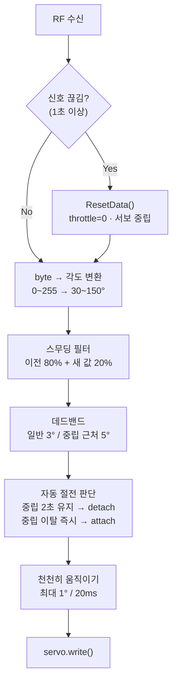

# 신호 안정화

스무딩 필터, 데드밴드, 페일세이프, 서보 자동 절전, 천천히 움직이기를 조합하여 서보 떨림을 제거하고 신호 끊김을 안전하게 처리하는 방법을 설명합니다.

각 기법은 독립적으로 동작하며 순서대로 서보 목표값에 적용됩니다. 스무딩 → 데드밴드 → 천천히 움직이기 순서로 처리되고, 페일세이프와 자동 절전은 조건에 따라 독립적으로 작동합니다.

---

<br>

## 처리 순서



---

<br>

## 스무딩 필터

급격한 조이스틱 움직임을 부드럽게 만든다. 이전 값과 새 목표값을 가중 평균한다.

```cpp
const float SMOOTHING = 0.2;

smoothed_aileron  = smoothed_aileron  * (1.0 - SMOOTHING) + aileron_target  * SMOOTHING;
smoothed_elevator = smoothed_elevator * (1.0 - SMOOTHING) + elevator_target * SMOOTHING;
```

`SMOOTHING = 0.2`이면 새 값을 20%, 이전 값을 80% 반영한다.

| SMOOTHING 값 | 특성 |
|-------------|------|
| 0.1 | 매우 부드럽고 느린 반응 |
| 0.2 (기본) | 부드러움과 반응속도의 균형 |
| 0.5 이상 | 빠른 반응, 떨림 증가 |

---

<br>

## 데드밴드

목표값과 현재값의 차이가 데드밴드 이내이면 서보를 이동하지 않는다. 미세한 노이즈로 인한 서보 떨림을 제거한다.

```cpp
int applyDeadband(int current, int target, int deadband = 3) {
    int deadband_actual = deadband;
    if (target >= 85 && target <= 95) {
        deadband_actual = 5;  // 중립 근처는 데드밴드를 5도로 확대
    }
    if (abs(target - current) <= deadband_actual) return current;
    return target;
}
```

| 구간 | 데드밴드 | 이유 |
|------|---------|------|
| 일반 구간 | 3도 | 일반 노이즈 흡수 |
| 중립 (85~95°) | 5도 | 중립 근처 떨림 집중 제거 |

---

<br>

## 페일세이프

마지막 RF 수신 후 1초 이상 신호가 없으면 `ResetData()`를 호출하여 안전값으로 전환한다.

```cpp
unsigned long lastRecvTime = 0;

void loop() {
    if (radio.available()) {
        radio.read(&data, sizeof(Signal));
        lastRecvTime = millis();
    }

    if (millis() - lastRecvTime > 1000) {
        ResetData();  // throttle=0, aileron=127, elevator=127
    }
}

void ResetData() {
    data.throttle = 0;    // 모터 즉시 정지
    data.aileron  = 127;  // 서보 중립
    data.elevator = 127;  // 서보 중립
    data.rudder   = 127;
}
```

신호가 복구되면 `radio.available()`이 다시 `true`가 되어 자동으로 정상 동작을 재개한다.

---

<br>

## 서보 자동 절전

중립 근처(85~95° / 80~100°)에서 2초 이상 머물면 서보를 `detach()`한다. 중립을 벗어나면 즉시 `attach()`하여 제어를 재개한다.

```cpp
// 중립 유지 중 → 2초 경과 시 detach
if (aileron_output >= 85 && aileron_output <= 95) {
    if (aileron_neutral_time == 0) aileron_neutral_time = now;
    else if (now - aileron_neutral_time > 2000 && aileron_attached) {
        servoAileron.detach();
        aileron_attached = false;
    }
} else {
    // 중립 벗어남 → 즉시 attach
    if (!aileron_attached) {
        servoAileron.attach(SERVO_AILERON_PIN);
        aileron_attached = true;
    }
    aileron_neutral_time = 0;
}
```

`detach()` 상태에서는 서보에 PWM 신호를 보내지 않아 전류 소모와 발열이 줄어든다.

---

<br>

## 천천히 움직이기

20ms마다 서보를 최대 1도씩만 이동하여 급격한 전류 급증을 방지한다.

```cpp
const unsigned long SERVO_UPDATE_INTERVAL = 20;

if (now - lastServoUpdate >= SERVO_UPDATE_INTERVAL) {
    lastServoUpdate = now;

    if (current_aileron_pos < aileron_output)
        current_aileron_pos = min(current_aileron_pos + 1, aileron_output);
    else if (current_aileron_pos > aileron_output)
        current_aileron_pos = max(current_aileron_pos - 1, aileron_output);

    servoAileron.write(current_aileron_pos);
}
```

최대 이동 속도는 1도/20ms = 50도/초다. 더 빠른 반응이 필요하면 한 번에 이동하는 도수를 늘리거나 `SERVO_UPDATE_INTERVAL`을 줄인다.

---

<br>

## 참고 사항

- ESC와 서보의 PWM 매핑은 [05-esc-servo.md](./05-esc-servo.md)를 참고하세요.
- RF 수신 구조와 `radio.available()` 폴링 방식은 [02-rf-communication.md](./02-rf-communication.md)를 참고하세요.
